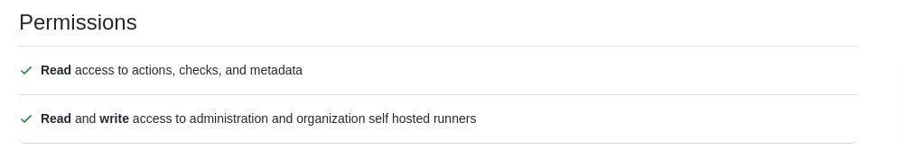
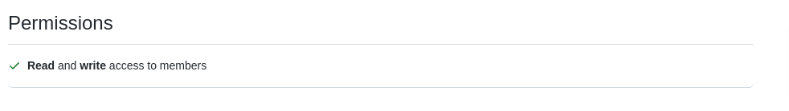
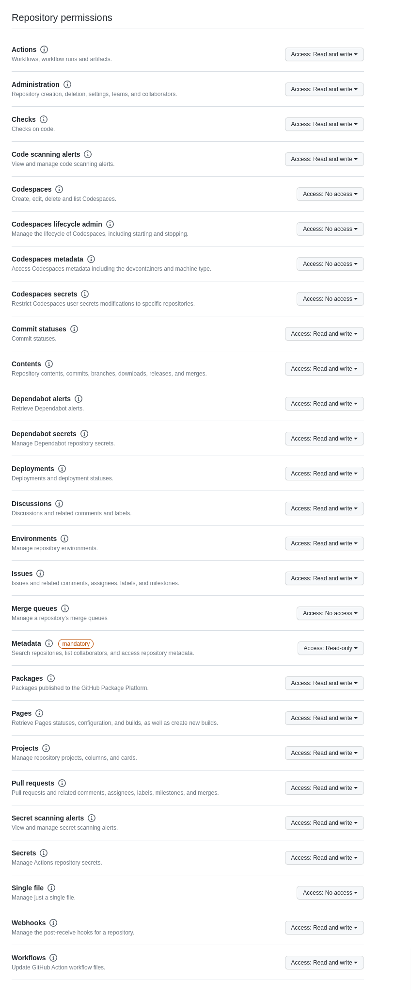

# Backstage-demo

TL,DR, if you want to just setup the demo go to [here](#demo-preparation)
This demo is intended to show what a good developer experience might look like when developing applications to be deployed on OpenShift and the eco-system of tools that come with it.
The developer experience is divided in four pillars which are tightly interconnected but that we are going to examine separately.

1. the onboarding experience.
2. the coding time.
3. the build time.
4. the run time.

The objective of this demo is to explore how we can get a better and better experience while at the same time maintaining the following requirements:

1. Security. There is tension between making everything self-serviced and everything secure. When these two requirements come to a odd, security should win.
2. Scalability. whether we are supporting a team of developers with a few software components or hundreds of teams and thousands of components the cost should be the same. To do so we deploy everything via gitops and we automate all of the configuration/maintenance operations.

Here is the [demo script](./demo-script.md).

## Onboarding time

The onboarding time is the first time a developer experience the platform that comprise all of the tools. Onboarding should be as seamless as possible. Right now the onboarding experience is the following:

1. user on-boarding. A user must be invited to the github organization. This is equivalent to HR onboarding an employee into the enterprise IDP.
2. Application onboarding. An application is declared to exist and belong to a team. This application is given a set of namespace for its SDLC. This process is not defined yet.
3. Component onboarding. A software component which resides in a repo is onboarded to the system. It will be pre-configured to work with OpenShift Dev Spaces and to be deployed by the pipelines to the previously defined namespace. This happens via the scaffolder feature of Backstage

## Code time

The purpose of the coding time experience is to provide a comfortable environment for developers to code and to run their inner loop. Ideally setting up the workspace should be immediate and the inner loop should be very fast (no more than ~30 seconds) while at the same time running the software components in an environment that is as close as possible as to what production will be.
In this demo the coding is done in OpenShift Dev Spaces. Each developer gets one or more workspaces for their software components which are easily accessible from Backstage.

## Build time

The purpose of the build time experience is to keep running pipeline simple for the developers while at the same time allowing for pipelines rich of functionalities. This can be done with the concept of pipeline as a service by which we mean that a central team manages one or more pipelines and developer *invoke* those pipelines as is they were a service, passing some parameters.
In this demo pipelines are implemented with github workflows and the concept of pipeline as a service is implemented using the shared workflow features.
When new components are created via scaffholder, also the pipeline is configured, so in theory a component is ready to be deployed to production right away after being created.

## Runtime

The runtime for the demo is OpenShift. The concept of a good runtime experience for a developer is that any piece of infrastructure needed to run the application should be self serviceable, possibly via manifests that will be deployed to OpenShift together with the rest of the application manifests. This includes also piece of infrastructure external to Openshift.
In this demo we have several operator that keep the configuration internal to OpenShift tidy and scale to any number of teams being ondoarded (permissions, quotas, etc). There are no example of external configuration at the moment.

For the future we plan to add monitoring to the runtime experience.

## Demo preparation

### Repository preparation

Fork the following repo `https://github.com/raffaelespazzoli/backstage-demo` to your organization.
Then execute the following commands

```shell
export github_organization= #set your Git Hub org name here
export base_domain=$(oc get dns cluster -o jsonpath='{.spec.baseDomain}')
```

```shell
git clone git@github.com:${github_organization}/backstage-demo.git
cd backstage-demo
find . -type f -not -path '*/\.git/*' -exec sed -i "s/raffaelespazzoli/${github_organization}/g" {} +
find . -type f -not -path '*/\.git/*' -exec sed -i "s/raf-backstage-demo/${github_organization}/g" {} +
find . -type f -not -path '*/\.git/*' -exec sed -i "s/control-cluster-raffa.demo.red-chesterfield.com/${base_domain}/g" {} +
git add -A
git commit -m "initial customization"
git push
cd ..
```

Fork the following repo `https://github.com/raf-backstage-demo/shared-workflows` to your organization.
Then execute the following commands

```shell
git clone git@github.com:${github_organization}/shared-workflows.git
cd shared-workflows
find . -type f -not -path '*/\.git/*' -exec sed -i "s/raf-backstage-demo/${github_organization}/g" {} +
find . -type f -not -path '*/\.git/*' -exec sed -i "s/control-cluster-raffa.demo.red-chesterfield.com/${base_domain}/g" {} +
git add -A
git commit -m "initial customization"
git push
cd ..
```

Fork the following repo `https://github.com/raf-backstage-demo/software-templates` to your organization.
Then execute the following commands

```shell
git clone git@github.com:${github_organization}/software-templates.git
cd software-templates
find . -type f -not -path '*/\.git/*' -exec sed -i "s/raf-backstage-demo/${github_organization}/g" {} +
find . -type f -not -path '*/\.git/*' -exec sed -i "s/control-cluster-raffa.demo.red-chesterfield.com/${base_domain}/g" {} +
git add -A
git commit -m "initial customization"
git push
cd ..
```

Fork the following repo `https://github.com/raf-backstage-demo/backstage-app-demo` to your organization.
Edit this code to add and remove backstage plugins. Also in order for the image to be available at least the packages produced by this repo must be publicly available.

```shell
git clone git@github.com:${github_organization}/backstage-app-demo.git
cd backstage-app-demo
find . -type f -not -path '*/\.git/*' -exec sed -i "s/raffaelespazzoli/${github_organization}/g" {} +
find . -type f -not -path '*/\.git/*' -exec sed -i "s/raf-backstage-demo/${github_organization}/g" {} +
git add -A
git commit -m "initial customization"
git push
cd ..
```

Create the following repo in your organization: `https://github.com/${github_organization}/approved-namespaces` with an empty readme file.

The rest of the demo should be deployed by the gitops operator following the steps below.

### Manual steps

This demo is based on GitHub. Create an github org that you'll use with this demo and add a couple of teams.
It requires some manual preparation steps for tasks that do not seem automate-able on GitHub (at least i was no able to automate them).

1. create a new organization or reuse an existing one.
2. create an Oauth app (under 'Developer Settings') in this organization for backstage. The call back url should be `https://backstage.apps.${base_domain}/api/auth/github`
3. create an Oauth app in this organization for OpenShift Dev Spaces. The call back url should be `https://devspaces.apps.${base_domain}/api/oauth/callback`
4. create an Oauth app in this organization for OpenShift. The call back url should be `https://oauth-openshift.apps.${base_domain}/oauth2callback/backstage-demo-github/`
5. create a Personal Access Token (PAT) with an account that is administrator to the chosen organization.
6. create a GitHub application in this organization for the github action runner controller following the instructions [here](https://github.com/actions-runner-controller/actions-runner-controller#deploying-using-github-app-authentication). Store the ssh key pem in a file called `github_action_runner_app.pem`, it will be ignored by git. The callback url should be `https://ghr.apps.${base_domain}`.



7. create a GitHub Application for the group-sync-operator following the instructions [here](https://github.com/redhat-cop/group-sync-operator#as-a-github-app). Store the ssh key pem in a file called `group-sync-operator-app-key.pem`, it will be ignored by git.



8. create a GitHub Application for the vault-config-operator. Store the ssh key pem in a file called `vault-github-app-key.pem`, it will be ignored by git. Follow [these instructions](https://github.com/martinbaillie/vault-plugin-secrets-github#setup-github)



9.  create an organization in quay (this should have the same name as the github org) and create a token with admin privileges on it.


10. create and account in [cockrachdb serverless](https://www.cockroachlabs.com/get-started-cockroachdb/) and extract a service account with full control.

Create a client secret for each of the OAuth apps.

Create a file called `secrets.sh` and store it at the top of this repo, it will be ignored by Git.

```shell
export github_organization=<org_name>
export backstage_github_client_id=<backstage_oauth_app_id>
export backstage_github_client_secret=<backstage_oauth_app_secret>

export devspaces_github_client_id=<devspaces_oauth_app_id>
export devspaces_github_client_secret=<devspaces_oauth_app_secret>

export ocp_github_client_id=<ocp_oauth_app_id>
export ocp_github_client_secret=<ocp_oauth_app_secret>
export org_admin_pat=<pat token>

export action_runner_github_app_id=<application_id_for_action_runner>
export action_runner_github_app_installation_id=<application_installation_id_for_action_runner>
export action_runner_github_app_private_key_file_path=./github_action_runner_app.pem

export group_sync_github_app_id=<application_id_for_group_sync-operator>
export group_sync_operator_github_app_key_file_path=./group-sync-operator-app-key.pem

export vault_github_app_id=<application_id_for_vault>
export vault_github_app_private_key_file_path=./vault-github-app-key.pem

export vault_quay_app_token=<quay app token>
export quay_organization=<quay-organization> #we assume it's the same as github
export vault_quay_app_username=<quay user name used to generate the token>

export cockroachdb_secret=<service_account_secret-token>
export cockroachdb_key=<service_account_name>
```

now you can source the file and populate the environment variables any time:

```shell
source ./secrets.sh
```

Run the following commands to populate the Kubernetes secrets with the previously generated values (this is fine for a demo, it might not be fine for a production environment):

```shell
oc create namespace openshift-devspaces
oc create secret generic github-oauth-config --from-literal=id=${devspaces_github_client_id} --from-literal=secret=${devspaces_github_client_secret} -n openshift-devspaces
oc label secret github-oauth-config -n openshift-devspaces --overwrite=true app.kubernetes.io/part-of=che.eclipse.org app.kubernetes.io/component=oauth-scm-configuration
oc annotate secret github-oauth-config -n openshift-devspaces --overwrite=true che.eclipse.org/oauth-scm-server=github
oc create secret generic ocp-github-app-credentials -n openshift-config --from-literal=client_id=${ocp_github_client_id} --from-literal=clientSecret=${ocp_github_client_secret}
oc new-project backstage
oc create secret generic github-credentials -n backstage --from-literal=AUTH_GITHUB_CLIENT_ID=${backstage_github_client_id} --from-literal=AUTH_GITHUB_CLIENT_SECRET=${backstage_github_client_secret} --from-literal=GITHUB_TOKEN=${org_admin_pat} --from-literal=GITHUB_ORG=${github_organization}
oc new-project actions-runner-system
oc create secret generic controller-manager -n actions-runner-system --from-literal=github_app_id=${action_runner_github_app_id} --from-literal=github_app_installation_id=${action_runner_github_app_installation_id} --from-file=github_app_private_key=${action_runner_github_app_private_key_file_path}
oc new-project group-sync-operator
oc create secret generic github-group-sync -n group-sync-operator --from-literal=appId=${group_sync_github_app_id} --from-file=privateKey=${group_sync_operator_github_app_key_file_path}
oc new-project vault-admin
vault_github_app_private_key=$(cat ${vault_github_app_private_key_file_path}| sed 's/^/    /') envsubst < ./vault-github-plugin-creds-secret.yaml | oc apply -f - -n vault-admin
envsubst < ./vault-quay-plugin-creds-secret.yaml | oc apply -f - -n vault-admin
oc create namespace openshift-dbaas-operator
oc create secret generic cockroachdb-admin -n openshift-dbaas-operator --from-literal=apiSecretKey=${cockroachdb_secret}
```

### Deploy the gitops operator

This demo has the following system requirements:

1. minimum cluster memory capacity 70 GB
2. minimum cluster cpu capacity: 20 CPUs
3. minimum worker node size 16GB 4CPUs (needed for OpenShift Dev Spaces)

now from your modified `https://github.com/${github_organization}/backstage-demo` repo run the following commands

```shell
oc apply -f ./argocd/operator.yaml
oc apply -f ./argocd/rbac.yaml
# wait a couple of minutes...
oc apply -f ./argocd/argocd.yaml
oc apply -f ./argocd/argo-root-application.yaml
```

You may need to resync a few times to get all the argocd apps going. Check the gitops status here: `https://openshift-gitops-server-openshift-gitops.apps.${base_domain}`
Once sonarqube is up and running connect to it `https://sonarqube-sonarqube.apps.${base_domain}` with admin/admin and create a new admin token (Administration->security->users->admin->tokens).
Add it to your ./secrets.sh file with the env variable ${sonarqube_token}

then run these commands

```shell
source ./secrets.sh
oc create secret generic sonarqube-credentials -n backstage --from-literal=SONARQUBE_TOKEN=${sonarqube_token}
oc annotate secret sonarqube-credentials -n backstage reflector.v1.k8s.emberstack.com/reflection-allowed="true"
oc annotate secret sonarqube-credentials -n backstage reflector.v1.k8s.emberstack.com/reflection-allowed-namespaces=""
```

This should be all to setup the demo.

Start enjoying the demo from here `https://backstage.apps.${base_domain}`.

Once everything is up and running you can run the [demo script](./demo-script.md).

## Cleanup

```shell
oc delete -n openshift-config secret ocp-github-app-credentials
oc delete -n openshift-config secret ghcr-puller
oc delete -n openshift-config secret ghcr-pusher

oc delete -n openshift-devspaces secret github-oauth-config
oc delete -n backstage secret github-credentials
oc delete -n actions-runner-system secret controller-manager
oc delete -n group-sync-operator secret github-group-sync
oc delete -n vault-admin secret vault-github-plugin-creds

oc delete project eclipse-che
oc delete project backstage
oc delete project actions-runner-system
oc delete project group-sync-operator
oc delete project vault-admin
```

## Main Features of this demo

In no particular order, these are the features that this demo intend to showcase.

- all the dev platform set up is managed in a gitops way with argocd
- process to create new apps with approval step from the platform team
- process + golden path to create new components for an app (does not require approvals). Based on backstage template. The result is a ready to use git repo and component that can be deployed up to production.
- automatic namespace configuration. When an app is created the needed namespace to support the app SLDC are created and configured. the configuration includes:
  - quotas
  - rbac
  - pull-secret for run namespaces
  - push-secret and git secret for build namespace
  - service mesh membership
  - vault access configuration for app secrets
  - github action runner deployment for build namespaces
- automatic group sync from github teams
- product/app/service catalog via backstage
- inner loop via OpenShift Dev Spaces. each dev gets access to a namespace in which they can stand up a theia/vscode/intellij instance pointing to the repo of their components and code immediately
- outer loop via github action. A pipeline as a service model is implemented as part og the golden path. Dev can call that pipeline of write their own.
- PR checks implemented as ci
- pipeline observability suite via Pelorus. Pelorus exposes the Accelerate metrics
- runtime observability with RED,USE and Error budget dashboards/alerts
- transparent service mesh onboarding

## Notes

at the moment is still unclear what creates namespaces. regardless of that, namespace annotation are considered trusted and several security features revolve around them. These are the well known annotations:

- `app` : name of the app deployed to this namespace. This is used by the github runner to pick jobs from any component related to this app. For this to be secure, this piece of information needs to be trusted on the github workflow definition side.
- `team`: name of the team who owns this namespace (it will be considered an OCP group and given edit rights).
- `build-namespace`: the name of the namespace in which the pipeline which deploys to this namespace runs. In the build-namespace a github runner is deployed with edit permissions.
- `size`: determines the quota given to the namespace. Allowed values `small`, `medium`, `large`.
- `environment`: the purpose of the namespace. If environment equals build, an action runner for that app will be deployed. Other special behaviors related to environment might added in the future.

Open Questions/challenges:

Processes:

1. what is the system of records of applications (aggregation of components)? Answer for now it is Backstage `System` object
2. what is the system of records of environments (from which namespaces can be derived)? metadata of the System object
3. what is the best approach for inner loop?

Tech:

1. OpenShift Dev Spaces still does not have a good inner loop. perhaps integrate tilt?

Demo next steps

- Integrate pelorus and monitoring of ci/cd metrics in backstage
- implement the inner loop in Dev Spaces, improve workspace boot time?
- harden the pull/push secret scopes to exactly the repos needed by the app
- create a git token secret for the ci/cd process (generalizes the approach when not using github action)
- move to tekton when pipeline as a service is supported.
- add support for standard branching model and branch namespaces.
- add support for gitops based CD.
- add support for advanced deployment models (blue/green, canary, dark)
- evidence, attestations, policies and enforcement. In general tssc.

Missing automation that requires significant implementation:

1. operator/automation that looks at Systems and components in backstage and creates annotation in namespaces to describe allowed repos
2. operator/automation that looks at gitrepo branches and creates branch-dedicated namespaces (see this operator https://github.com/dmytrostriletskyi/stale-feature-branch-operator)
