# Demo Script

Once everything is installed correclty you will have a fill blown IDP with a couple of Golden Paths.
This demo script gives you an idea of what you can do with it.

## Application Onboarding

An application is comprised of several components, before we can start to deploy these components we need to onboard the application itself. This will provision the namespace and other resources needed to build and run components.
Navigate to backstage and click create component.


select application template:


populate the form as run the backstage template:


This creates a new gitops repo for the new application component's manifests and a pull request to the approved-namespaces repos.
Impersonating the platform team, approve the pull request:


ArgoCD may take a minute to react to the new manifests.
In the meantime verify that the `myapp-gitops` repo has been created and it empty:


This is where all the component manifests will reside

Verify that the `myapp` SDLC namespace have been created:


Verify that in the build namespace pods for github action runner and argocd are created


Verify that in the build namespaces some secrets needed for the build are automatically provisioned


If you accidentally delete those secrets, they will be re-provisioned.

Verify that you can access the new argocd instance for the `myapp` application at https://tenant-gitops-server-myapp-build.apps.${baseurl}/applications


Only the root app will be present. This app will create any resource that is added to the `./resouces` folder of the `myapp-gitops` repository. At the moment it's empty.

Now it's time to go back to Backstage and add one component to the the `myapp` application. Create a quarkus component:


Run the template. This will create a new `myquarkus` repository and a PR to the `myapp-gitops` repo adding the new manifests for this component.

Approve the PR to the `myapp-gitops` repository. This will be usually done by the developer team manager.


Verify that now the myapp ArgoCD is updated with new manifests:


The apps at this point will not be healthy as the application image may not be built yet. Not that in this demo as soon as an applicaiton image is built, it is immediately pushed to production. This is obviously a simplification.

Verify and explore the new `myquarkus` repository, it contains a hello world quarkus service


In Backstage, navigate to the `myquarkus` component page, you should see the following:


Notice that the SonarQube score should be already loaded. Click on one of the WebIDE links on the right:


Follow the DevWorkspace first-time instructions and you should get to a page in which you can edit the code and commit it back to the repository


Now back to Backstage, verify that the `myquarkus` component is being built:


Follow the links in the UI up to the GitHub Actions tab, verify that the build has been fully executed (this is a very minimal pipeline):


Go to Quay and verify that the image had been built and pushed:

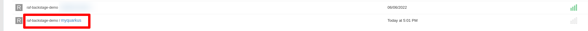

Go back to Backstage and verify that the `myquarkus` component pods has been deployed

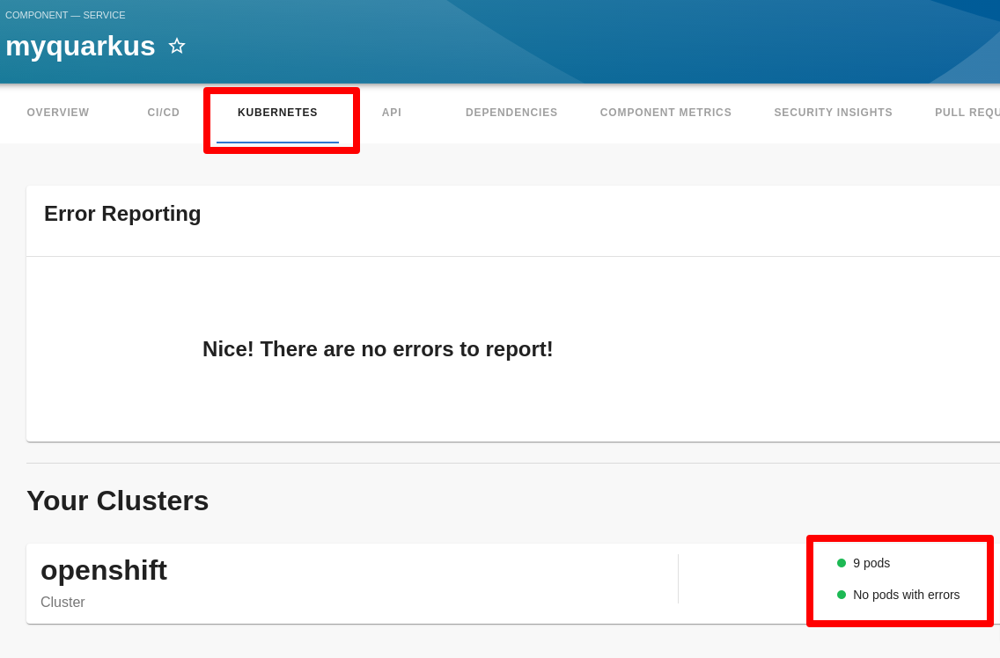

Verify that progressive delivery is enabled via ArgoRollouts. 
Run the following command

```shell
kubectl argo rollouts dashboard
```

and navigate to http://localhost:3100 and chose the `myapp-prod` namespace, you should see the following:

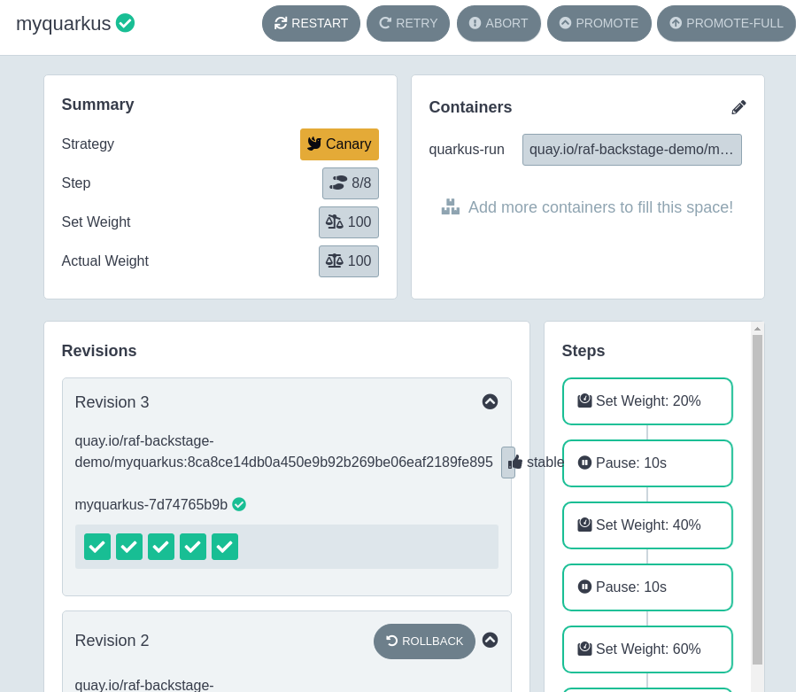

Go back to Backstage and click on the metrics link

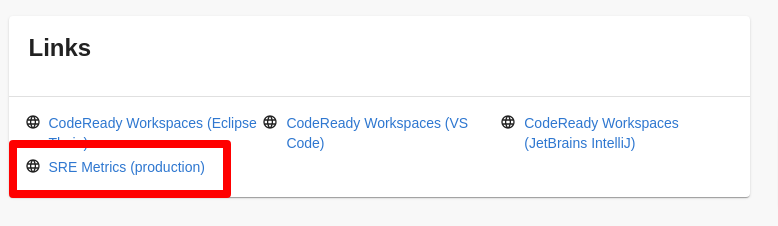

TODO Add image of SRE metrics

Now it's time to add a database component to the `myapp` application.
Navigate back to Backstage and select the database component

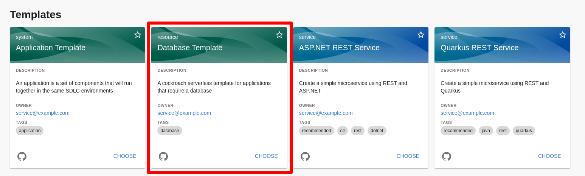

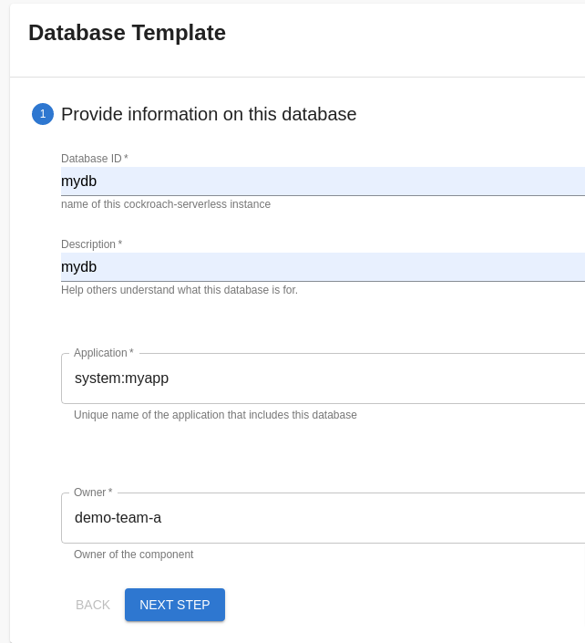

This will create a PR to the `myapp-gitops` repository, approve the PR

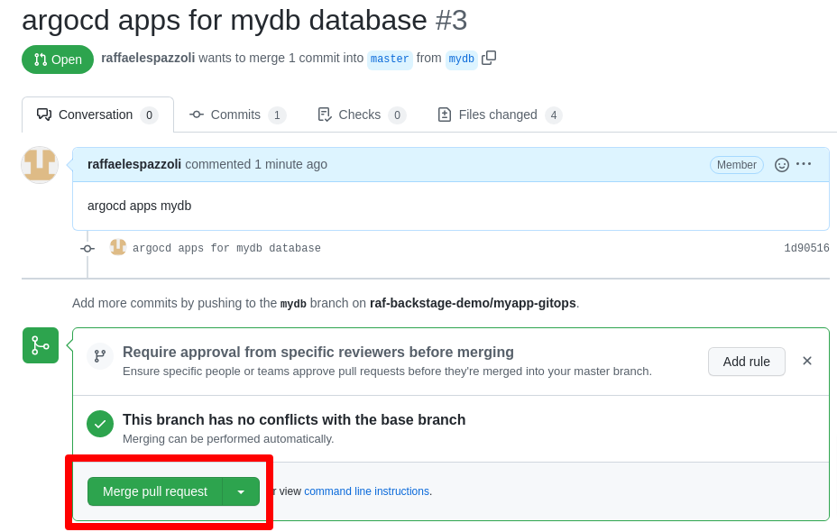

refresh the `myapp` argocd root application and verify that new applications have been added:

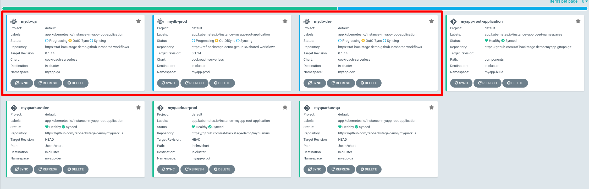

navigate to the cockroachDB console and verify that the instances for each environment have been created:

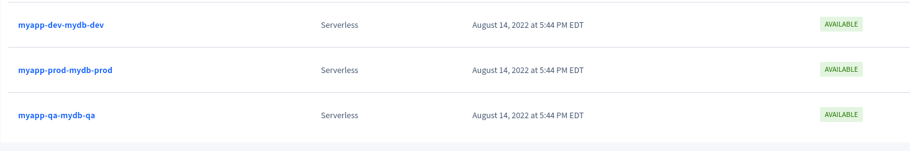

navigate to the Data Services tab in the OpenShift console and verify that the instances are detected:

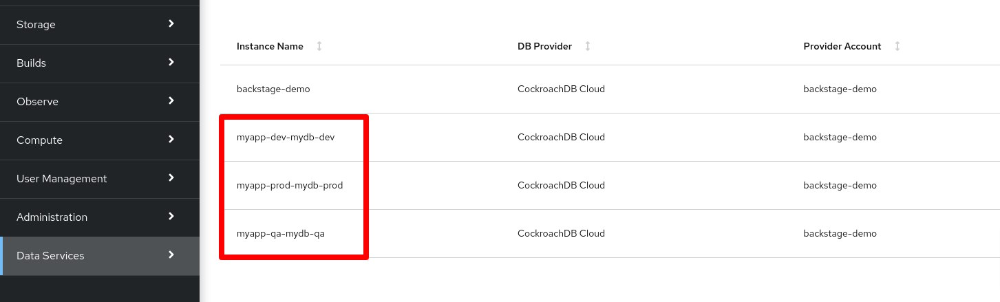

navigate to the Vault Console https://vault.apps.${base_domain}. Use this script to retrieve the root token

```shell
oc get secret vault-init -n vault -o jsonpath='{.data.root_token}' | base64 -d
```

verify that database connections are created for each of the database instances:

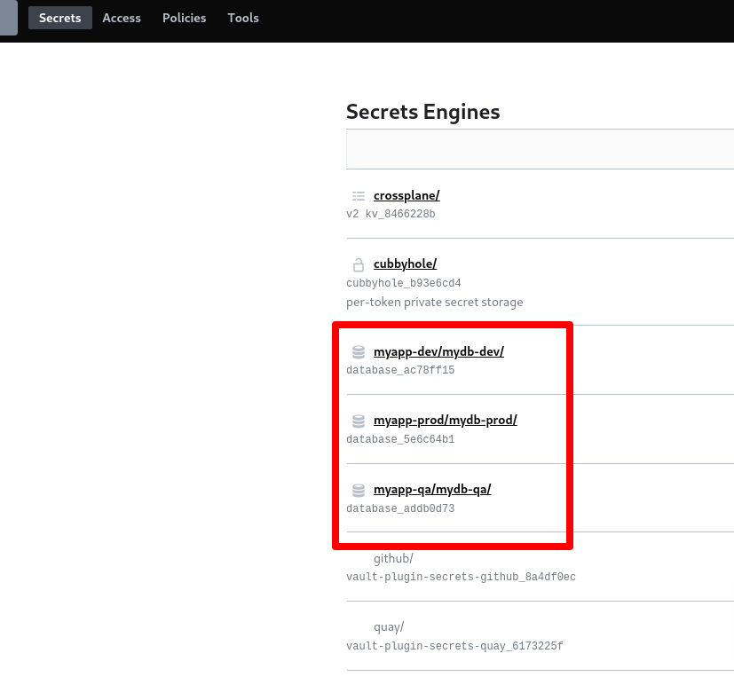

navigate to one of the roles in one of the database connections and verify that it is possible to generate credentials

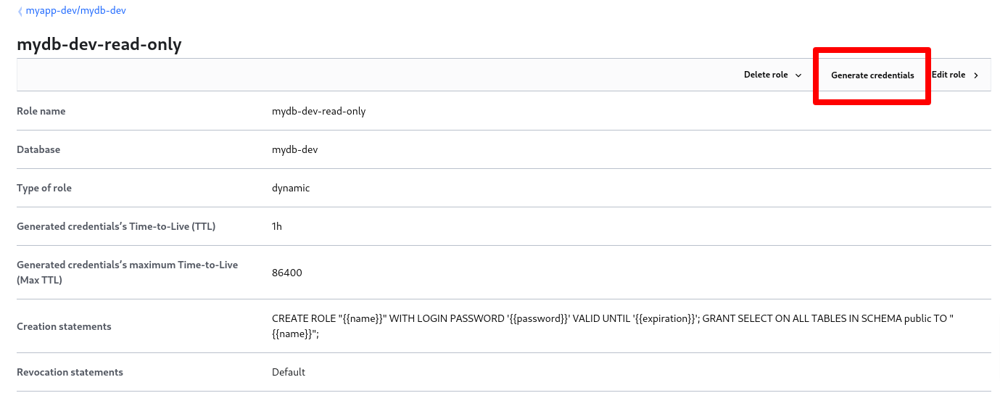

Let's now configure to our myquarkus application to connect to the databases.
For the first time on this demo we have to actually write some code, so bear with us.
Checkout the code or access it via the WebIDE and perform the following changes:

in `src/main/java/io/raffa` create a file named `SantaClausService.java` file with the following content:

```java
package io.raffa;

import java.util.List;

import javax.enterprise.context.ApplicationScoped;
import javax.inject.Inject;
import javax.persistence.EntityManager;
import javax.transaction.Transactional;

@ApplicationScoped
public class SantaClausService {

    @Inject
    EntityManager em;

    @Transactional
    public List<Gift> getGifts() {
        return (List<Gift>) em.createQuery("select g from Gift g").getResultList();
    }
```

in `src/main/java/io.raffa` create a file named `Gift.java` with the following content: 

```java
package io.raffa;

import javax.persistence.Entity;
import javax.persistence.GeneratedValue;
import javax.persistence.GenerationType;
import javax.persistence.Id;

@Entity
public class Gift {

    private Long id;
    private String name;

    @Id
    @GeneratedValue(strategy = GenerationType.SEQUENCE, generator="giftSeq")
    public Long getId() {
        return id;
    }

    public void setId(Long id) {
        this.id = id;
    }

    public String getName() {
        return name;
    }

    public void setName(String name) {
        this.name = name;
    }
}
```

in the `pom.xml` file add the following dependencies: 

```xml
    <dependency>
      <groupId>io.quarkus</groupId>
      <artifactId>quarkus-hibernate-orm</artifactId>
    </dependency>
    <dependency>
      <groupId>io.quarkus</groupId>
      <artifactId>quarkus-jdbc-postgresql</artifactId>
    </dependency>
    <dependency>
      <groupId>io.quarkus</groupId>
      <artifactId>quarkus-jdbc-h2</artifactId>
    </dependency>
```

in scr/main/resources/application.properties add the following configuration

```properties
quarkus.devservices.enabled=false

quarkus.vault.url = https://vault.vault.svc:8200
quarkus.vault.tls.skip-verify = true

quarkus.vault.authentication.kubernetes.role = database-engine-admin

quarkus.vault.credentials-provider.mydb.credentials-role = mydb-${myquarkus.environment.suffix}-read-write
quarkus.vault.credentials-provider.mydb.credentials-mount = myapp-${myquarkus.environment.suffix}/mydb-${myquarkus.environment.suffix}

%dev.quarkus.datasource.db-kind = h2
%test.quarkus.datasource.db-kind = h2
%test.quarkus.datasource.jdbc.url=jdbc:h2:mem:default
%dev.quarkus.datasource.jdbc.url=jdbc:h2:mem:default

mydb.id=dummy
%remote_dev.mydb.id = 3582
%qa.mydb.id = 3584
%prod.mydb.id= 3583

quarkus.datasource.db-kind = postgresql
%remote_dev.quarkus.datasource.credentials-provider = mydb
%qa.quarkus.datasource.credentials-provider = mydb
%prod.quarkus.datasource.credentials-provider = mydb
quarkus.datasource.jdbc.url = jdbc:postgresql://free-tier4.aws-us-west-2.cockroachlabs.cloud:26257/defaultdb?sslmode=require&options=--cluster%3Dmyapp-${myquarkus.environment.suffix}-mydb-${myquarkus.environment.suffix}-${mydb.id}

# drop and create the database at startup (use `update` to only update the schema)
quarkus.hibernate-orm.database.generation=drop-and-create
```

Notice the `mydb.id`, you need to figure out this id on your own. One way to do it is to go to the cockroachdb console and see what the connection string should look like

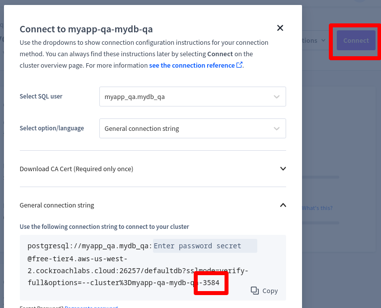

Commit this changes, this will trigger a build and roll-out of the app, verify that the pods are correct connected to the databases.