# Demo Script

Once everything is installed correclty you will have a fill blown IDP with a couple of Golden Paths.
This demo script gives you an idea of what you can do with it.

## Application Onboarding

An application is comprised of several components, before we can start to deploy these components we need to onboard the application itself. This will provision the namespace and other resources needed to build and run components.
Navigate to backstage and click create component.

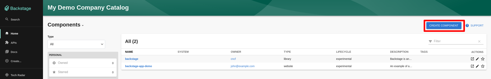

select application template:

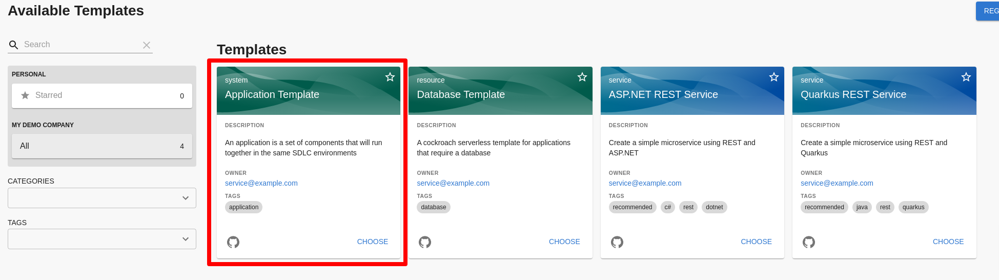

populate the form as run the backstage template:

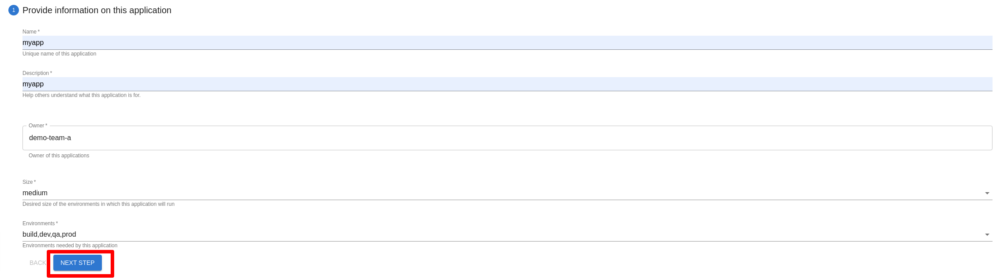

This creates a new gitops repo for the new application component's manifests and a pull request to the approved-namespaces repos.
Impersonating the platform team, approve the pull request:

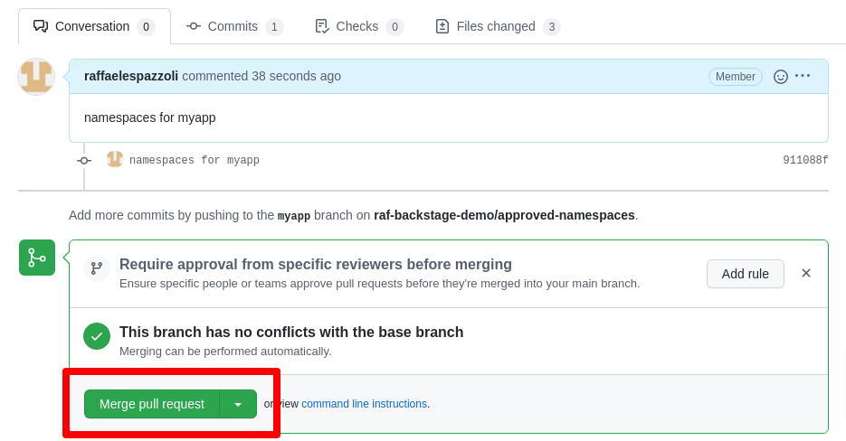

ArgoCD may take a minute to react to the new manifests.
In the meantime verify that the `myapp-gitops` repo has been created and it empty:

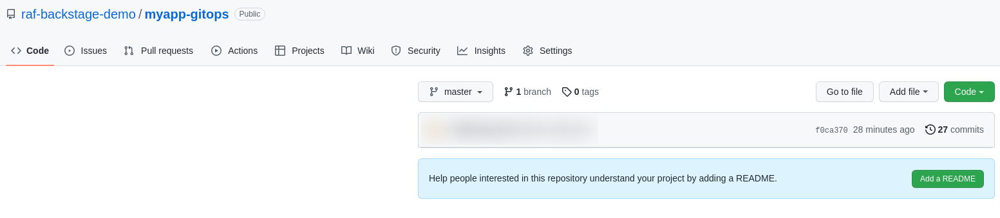

This is where all the component manifests will reside

Verify that the `myapp` SDLC namespace have been created:

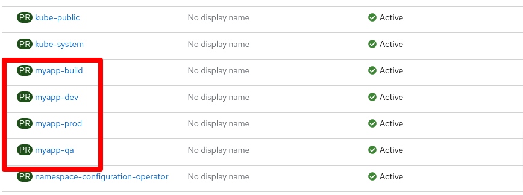

Verify that in the build namespace pods for github action runner and argocd are created

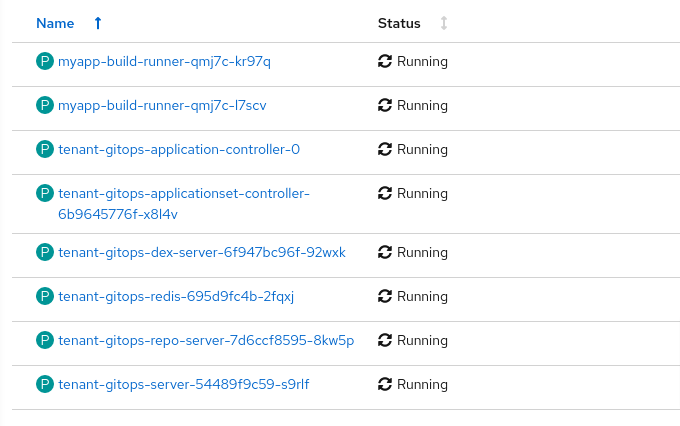

Verify that in the build namespaces some secrets needed for the build are automatically provisioned

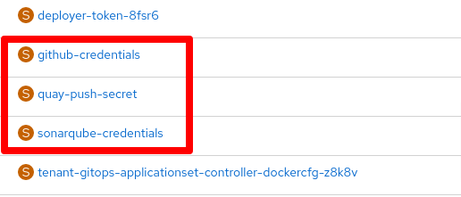

If you accidentally delete those secrets, they will be re-provisioned.

Verify that you can access the new argocd instance for the `myapp` application at https://tenant-gitops-server-myapp-build.apps.${baseurl}/applications

Only the root app will be present. This app will create any resource that is added to the `./resouces` folder of the `myapp-gitops` repository. At the moment it's empty.

Now it's time to go back to Backstage and add one component to the the `myapp` application. Create a quarkus component:

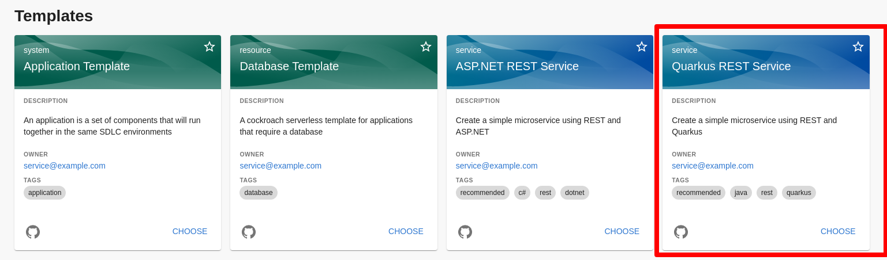

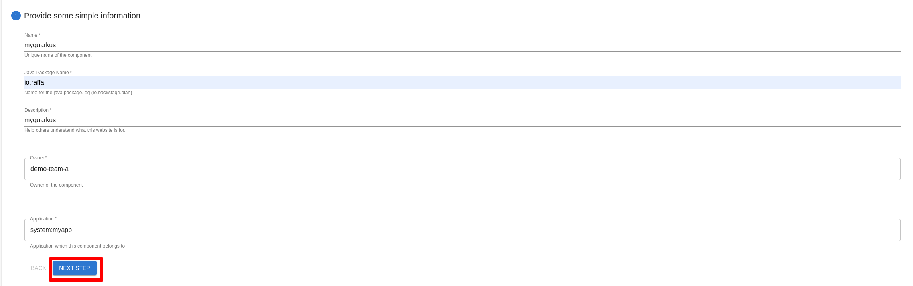

Run the template. This will create a new `myquarkus` repository and a PR to the `myapp-gitops` repo adding the new manifests for this component.

Approve the PR to the `myapp-gitops` repository. This will be usually done by the developer team manager.

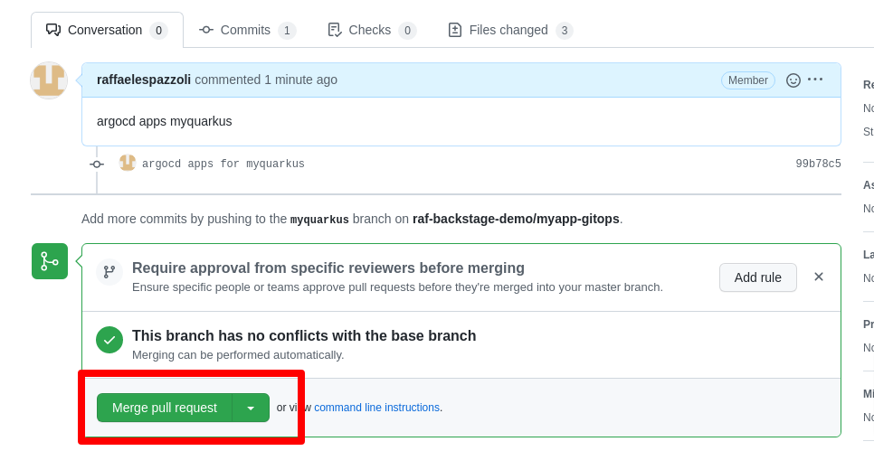

Verify that now the myapp ArgoCD is updated with new manifests:

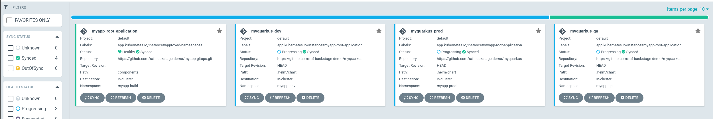

The apps at this point will not be healthy as the application image may not be built yet. Not that in this demo as soon as an applicaiton image is built, it is immediately pushed to production. This is obviously a simplification.

Verify and explore the new `myquarkus` repository, it contains a hello world quarkus service

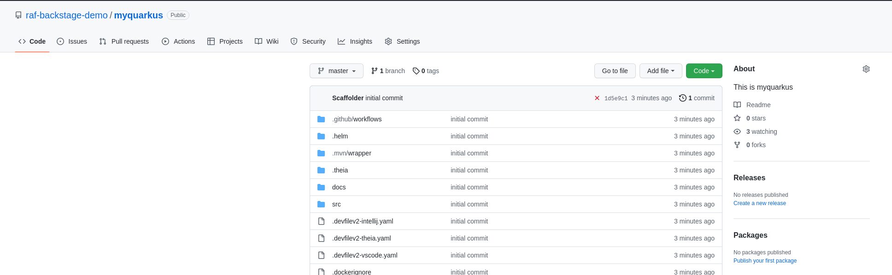

In Backstage, navigate to the `myquarkus` component page, you should see the following:

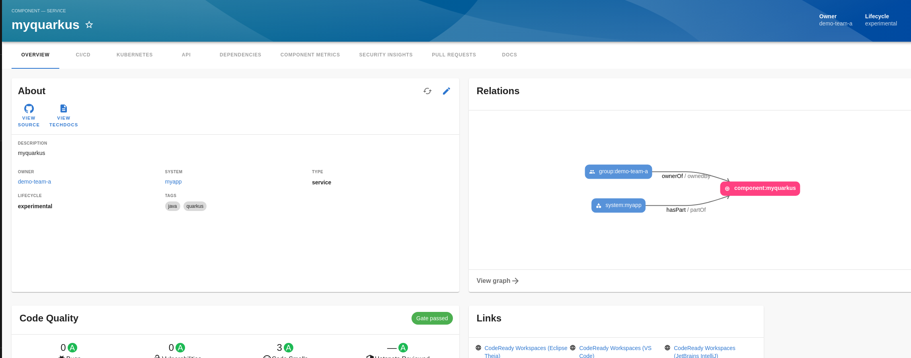

Notice that the SonarQube score should be already loaded. Click on one of the WebIDE links on the right:

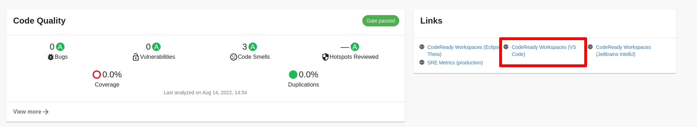

Follow the DevWorkspace first-time instructions and you should get to a page in which you can edit the code and commit it back to the repository

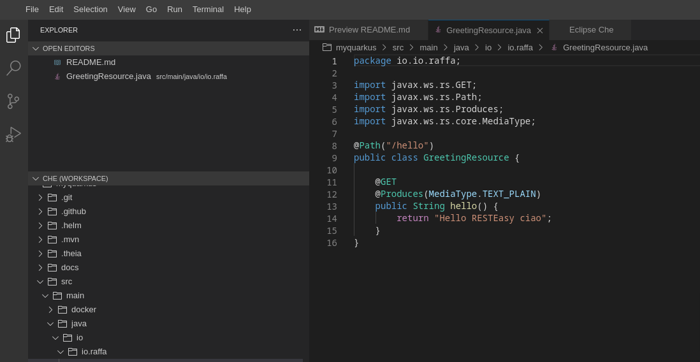

Now back to Backstage, verify that the myquarkus component is being built:

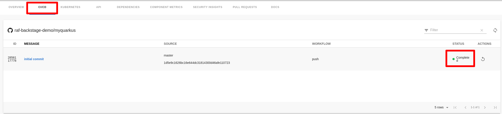

Follow the links in the UI up to the GitHub Actions tab, verify that the build has been fully executed (this is a very minimal pipeline):

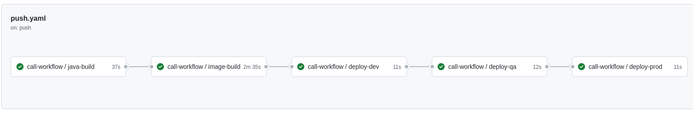